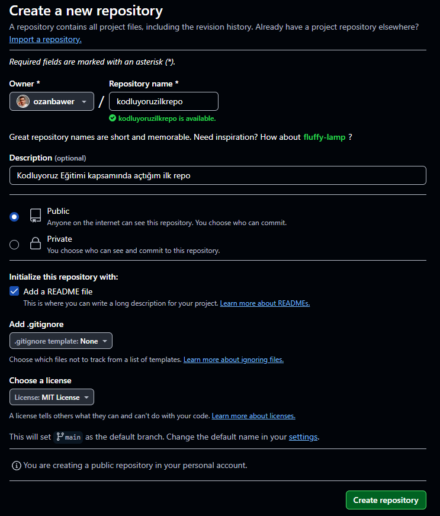

# kodluyoruzilkrepo
Kodluyoruz Eğitimi kapsamında açtığım ilk repo

Bu repo [Kodluyoruz](https://www.kodluyoruz.org) Frontend Web Development Patikası Eğitiminde oluşturduğumuz ilk repo. İçerisinde bir adet README dosyası, bir adet de index.html barındırıyor.
## Bu repo içerisinde başlangıç düzeyindeki derslerde öğrenilen dosyalar eklenmiştir



## Installation

Öncelikle projeyi clonelayın. (Buraya sizin reponuzdan aldığınız link gelecek)

```bash
git clone https://github.com/ozanbawer/kodluyoruzilkrepo.git
```

## Usage

Projeyi cloneladıktan sonra Visual Studio Code programında açınız.

Linux için:
```linux
cd kodluyoruzilkrepo
code .
```

## Contributing
Pull requestler kabul edilir. Büyük değişiklikler için, lütfen önce neyi değiştirmek istediğinizi tartışmak için bir konu açınız.


## License
[MIT](https://choosealicense.com/licenses/mit/)

